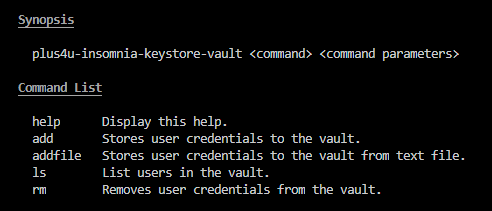

This tool for maintains AES-256 encrypted file with accessCodes to oidc.plus4u.net.
This project is extended copy of https://github.com/jiridudekusy/keystore-insomnia-oidc-plus4u

[Changelog](doc/CHANGELOG.md)

# How to install ?

`npm install -g plus4u-insomnia-keystore-vault`

# How to use ?

# How to develop ?

Publish new version
1. `npm pack`
2. `npm publish --registry https://registry.npmjs.org/`

